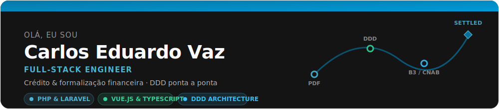
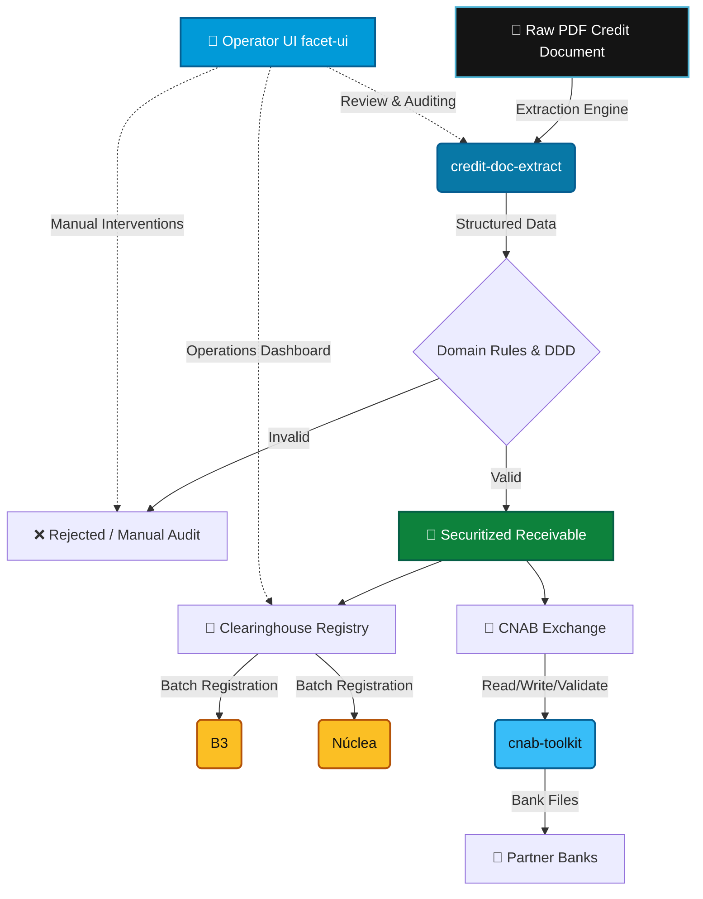

  

 

  
  
  

---

### 🚀 About Me

I am a **Full-Stack Software Engineer** specializing in the design and development of complex **credit and financial-formalization systems**. My work sits at the intersection of business-critical operations, structured domains, and highly reliable code pipelines. 

With a strong foundation in **Domain-Driven Design (DDD)** and architectural patterns, I bridge the gap between robust backends (PHP/Laravel) and performant, intuitive frontends (Vue.js/TypeScript). I'm committed to code quality, maintaining an average of **~92% automated testing coverage** across the systems I design and own.

---

### 💼 What I Do (Day to Day)

At my day job within a private fintech, I design and build the automated pipeline that transforms a raw PDF credit document into a registered, securitized receivable. This complex flow involves:

1. **Document Extraction:** Parsing raw credit files (PDFs) and extracting clean, structured domain models.
2. **Clearinghouse Registry:** Orchestrating batch registrations with major clearinghouses (**B3**, **Núclea**).
3. **Bank Exchange (CNAB):** Standardizing communication with partner banks via CNAB file generation, reading, and validation.
4. **Operator UI:** Creating high-fidelity, reactive dashboards that operators use to audit and resolve exceptions.

Here is a visual map of how these components connect:

*Note: The repositories highlighted below are open-source, generalized rebuilds of these exact fintech problem spaces.*

---

### 🛠️ Tech Stack & Toolkit

<table width="100%">
  <tr>
    <td width="50%" valign="top">
      <h4>Backend & Database</h4>
      
      
      
      
      
    </td>
    <td width="50%" valign="top">
      <h4>Frontend & Tooling</h4>
      
      
      
      
      
    </td>
  </tr>
  <tr>
    <td colspan="2" valign="top">
      <h4>Methodologies & Quality</h4>
      
      
      
    </td>
  </tr>
</table>

---

### 📂 Featured Open-Source Projects

I extract the architectural concepts from my daily fintech tasks and rebuild them as modular, open-source packages:

#### 🏦 [cnab-toolkit](https://github.com/carlosvoliv/cnab-toolkit)
> Schema-driven PHP engine to read, write, and validate Brazilian CNAB bank files (supporting both CNAB 240 and 400 structures with strict verification).
> 
> * **Key Stacks:** PHP, OOP, Schema Validation

#### 📄 [credit-doc-extract](https://github.com/carlosvoliv/credit-doc-extract)
> A Laravel + DDD parsing system designed to ingest raw PDFs, perform rule-based structured extraction, and output clean domain objects.
> 
> * **Key Stacks:** Laravel, DDD, PDF Parsing, Test-Driven Development (TDD)

#### 🎨 [facet-ui](https://github.com/carlosvoliv/facet-ui)
> A lightweight Vue 3 design system equipped with tokens-as-data, native dark mode support, and 19+ highly customizable presets.
> 
> * **Key Stacks:** Vue 3, TypeScript, CSS Variables, TailwindCSS

---

### 📊 GitHub Activity & Stats

  <table border="0">
    <tr>
      <td align="center" valign="middle">
        
      </td>
      <td align="center" valign="middle">
        
      </td>
    </tr>
    <tr>
      <td align="center" valign="middle" colspan="2">
        
      </td>
    </tr>
  </table>

---

### 🤖 Daily Workflow Note
I lean on AI tooling (such as Claude Code and Gemini-powered agents) as part of my daily engineering workflow. I treat it as an extension of my dev setup — not as a shortcut, but as a deliberate part of how I ship, refactor, and review high-quality code.

📫 Feel free to reach out via [LinkedIn](https://www.linkedin.com/in/carlosvoliv/) or drop an email!
